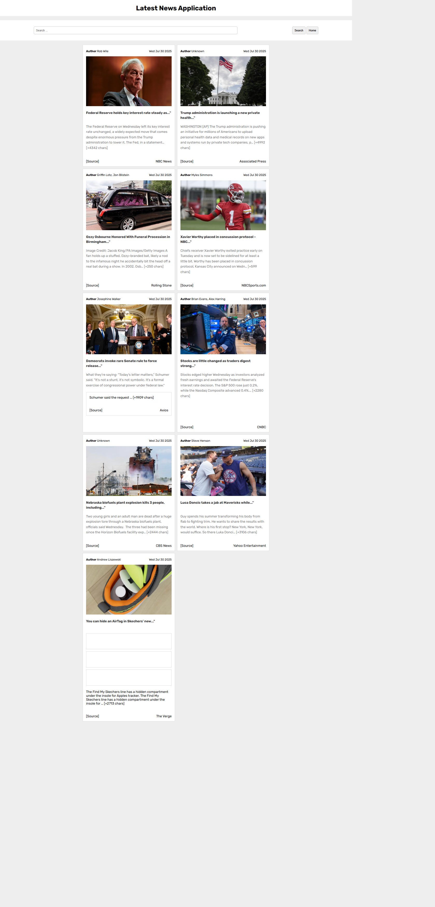

# 📰 News Explorer

## 📌 Description
A simple **News App** built with **JavaScript, HTML, and CSS**, powered by the [NewsAPI](https://newsapi.org/).  
The app fetches the latest top headlines from the US, displays them with images, authors, and sources, and allows users to **search for specific news articles** by title.  

---

## 🚀 Live Demo
[👉 Live Demo](https://amelchenni.github.io/Latest-News-With-API-App/)

---

## 📷 Screenshots


---

## 🛠️ Technologies Used
- HTML5
- CSS3
- JavaScript (Vanilla)
- [NewsAPI](https://newsapi.org/)

---

## ⚙️ Features
- 📂 Fetch latest top headlines from **NewsAPI**  
- 👤 Display article author, published date, source  
- 🖼️ Show news images (when available)  
- 🔍 Search functionality by article title  
- 📅 Clean formatted date display  
- 🔗 Direct link to full article  

---

## 🔮 Future Improvements
- [ ] Add **pagination / Load more button** for more articles  
- [ ] Add **search by keyword across API** (not just local titles)  
- [ ] Implement **dark mode** for better UX  
- [ ] Improve responsive design for mobile screens  
- [ ] Show "No results found" UI instead of alert  
- [ ] Add categories filter (Sports, Tech, Health, etc.)  
- [ ] Use **local storage** to save last search results  
- [ ] Add **loading spinner** while fetching data  

---

## 📄 Installation
1. Clone the repository:
   ```bash
   git clone https://github.com/AmelChenni/Latest-News-With-API-App.git
   cd Latest-News-With-API-App
